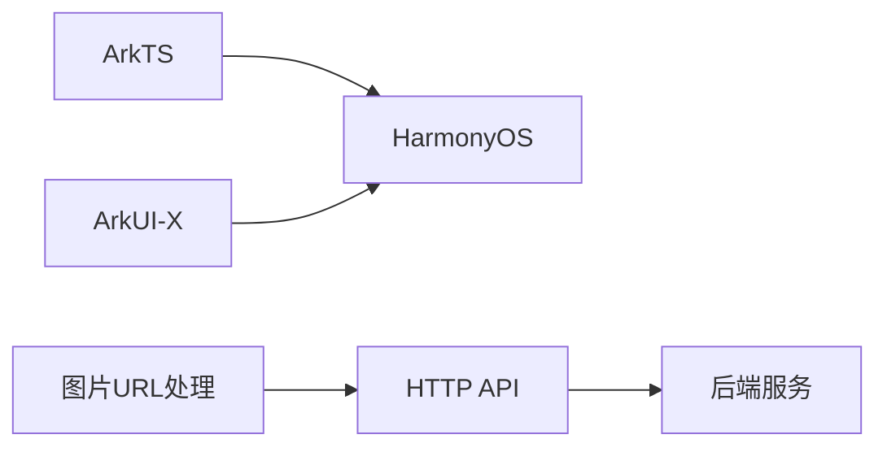
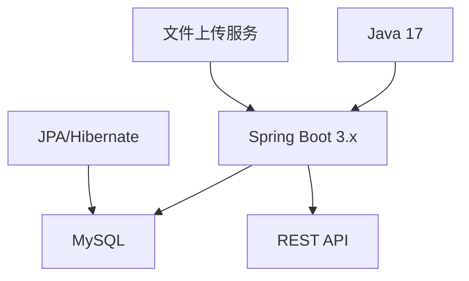

# 🌟 梦想生活规划师 APP

<div align="center">


</div>

## 📋 项目概述

基于鸿蒙HarmonyOS"梦想生活规划师"是一款助力梦想成真的生活伴侣应用，帮助用户制定、管理和实现个人梦想目标。应用通过科学的目标管理方法、社区互动和资源共享，为用户提供全方位的梦想实现支持。

## 💎 核心价值

- **🎯 梦想管理**：帮助用户系统化管理个人梦想和目标
- **📝 任务拆解**：将梦想分解为可执行的小任务，便于逐步实现
- **📊 进度追踪**：直观展示梦想实现的进度和成果
- **🤝 社区互动**：连接志同道合的用户，互相激励与支持
- **📚 资源共享**：提供实现梦想的相关学习资源和工具

## 🔧 技术架构

### 前端技术栈


- 🔹 **ArkTS**（基于鸿蒙HarmonyOS生态）
- 🔹 **ArkUI-X 5.0.4.106**
- 🔹 **智能图片URL处理**（自动适配不同环境）

### 后端技术栈


- 🔹 **Java 17**
- 🔹 **Spring Boot 3.x**
- 🔹 **JPA/Hibernate**
- 🔹 **MySQL 数据库**
- 🔹 **SpringDoc**（API文档）
- 🔹 **Lombok**
- 🔹 **文件上传与存储系统**

### 技术亮点

#### 🔄 删除功能的优化设计
- **交互设计**: 双重确认机制，避免误操作，保护用户数据安全
- **UI实现**: 根据页面状态动态调整按钮布局（创建模式下显示单个保存按钮，编辑模式下显示保存和删除两个按钮）
- **代码实现**: 
  ```typescript
  // 确认对话框实现
  showDeleteConfirmDialog(): void {
    const dialogOptions: promptAction.ShowDialogOptions = {
      title: '确认删除',
      message: '确定要删除这个任务吗？删除后将无法恢复。',
      buttons: [
        { text: '取消', color: '#666666' },
        { text: '删除', color: '#FF4757' }
      ]
    };
    
    promptAction.showDialog(dialogOptions)
      .then((result: DialogResultType) => {
        if (result.index === 1) {
          this.confirmDeleteTask(); // 执行删除
        }
      });
  }
  ```
- **状态管理**: 删除操作期间锁定界面，防止重复提交
- **错误处理**: 完善的异常捕获与用户友好的错误提示

### 项目规范
- 🔹 阿里巴巴Java开发手册
- 🔹 统一异常处理
- 🔹 RESTful API设计
- 🔹 数据校验和安全处理
- 🔹 环境适配与URL处理策略

## 📱 功能模块

### 1. 👤 用户系统
- 用户注册与登录
- 个人资料管理
- 用户关注与互动

### 2. ✨ 梦想管理
- 梦想创建与编辑
- 梦想删除功能（含删除确认机制）
- 梦想分类与标签
- 梦想进度跟踪
- 梦想优先级与截止日期设置
- 梦想图片上传与展示

### 3. ✅ 任务系统
- 任务创建与编辑
- 任务删除功能（含安全确认机制）
- 任务分解与关联
- 任务状态更新
- 任务提醒功能

### 4. 🌐 社区互动
- 动态发布与分享
- 点赞、评论功能
- 关注好友动态
- 成就分享与激励
- 图片分享与展示

### 5. 📖 资源中心
- 学习资源推荐
- 梦想实现工具推荐
- 用户资源分享

### 6. 📈 数据统计与分析
- 梦想完成率统计
- 任务执行情况分析
- 个人成长轨迹展示

### 7. 🔄 数据管理
- 全面的数据CRUD操作支持
- 安全的删除确认机制
- 直观的用户界面交互
- 跨页面数据同步更新
- 精心设计的删除操作流程

### 社区功能
1. 帖子发布功能：
   - 创建了PostCreatePage页面，支持用户发布带标题、内容、图片的社区动态
   - 实现关联梦想功能，允许用户关联自己的公开梦想
   - 支持多图上传，优化了图片布局显示
2. 帖子详情功能：
   - 创建了PostDetailPage页面，支持查看完整帖子内容和评论
   - 实现评论列表分页加载功能
   - 支持在详情页内直接发表评论和点赞
   - 修复了帖子详情页数据加载和显示问题，确保内容正确展示
3. API集成：
   - 添加了createPost方法用于创建新帖子
   - 添加了getPostById方法用于获取帖子详情
   - 添加了getDreamsByUserId方法用于获取用户梦想列表
4. 交互优化：
   - 在社区列表页添加了点击帖子跳转到详情页的功能
   - 优化了图片显示布局，根据图片数量动态调整显示方式
   - 支持点赞、评论、分享等社交互动功能

## 📂 项目目录结构

### 前端（ArkTS）
```
YaoYaoLingXian/
  ├── entry/                # 应用入口
  │   ├── src/              # 源代码
  │   │   ├── main/         # 主要代码
  │   │   │   ├── ets/      # ArkTS代码
  │   │   │   │   ├── services/  # 服务层
  │   │   │   │   │   ├── ApiService.ets  # API服务
  │   │   │   │   ├── pages/     # 页面组件
  │   │   │   │   ├── model/     # 数据模型
  │   │   │   │   ├── utils/     # 工具类
  │   │   │   ├── resources/ # 资源文件
  ├── AppScope/             # 应用范围配置
  ├── oh_modules/           # 依赖模块
```

### 后端（Java）
```
Backend/
  ├── src/
  │   ├── main/
  │   │   ├── java/          # Java源代码
  │   │   │   ├── controller/ # 控制器
  │   │   │   ├── service/    # 服务层
  │   │   │   ├── repository/ # 数据访问层
  │   │   │   ├── entity/     # 实体类
  │   │   │   ├── dto/        # 数据传输对象
  │   │   │   ├── config/     # 配置类
  │   │   │   ├── exception/  # 异常处理
  │   │   │   ├── util/       # 工具类
  │   │   ├── resources/      # 资源配置
  ├── pom.xml                 # Maven配置
```

## 💾 数据库设计

数据库采用MySQL，主要包含以下核心表：

| 表名 | 描述 | 主要字段 |
|------|------|---------|
| `user` | 用户信息 | id, username, nickname, avatar, email |
| `dream` | 梦想目标 | id, user_id, title, description, category, image_url |
| `task` | 任务 | id, dream_id, title, status, priority |
| `progress` | 进度记录 | id, dream_id, completion_rate, updated_at, images |
| `resource` | 资源 | id, title, url, type, description |
| `tag` | 标签 | id, name, category |
| `post` | 社区动态 | id, user_id, content, images, created_at |
| `comment` | 评论 | id, post_id, user_id, content |
| `like` | 点赞 | id, user_id, post_id, created_at |
| `follow` | 关注关系 | id, user_id, follow_id |

## 🌐 多环境支持

应用支持多种环境配置，通过智能URL处理实现跨环境资源访问：

```typescript
// 不同环境的API基础URL配置
class ApiConfig {
  readonly ANDROID_EMULATOR: string = 'http://10.0.2.2:8080/api';
  readonly DEVICE: string = 'http://192.168.31.75:8080/api';
  readonly LOCAL: string = 'http://localhost:8080/api';
}

// 智能图片URL处理，确保在不同环境中正确访问图片资源
export function processImageUrl(url: string): string {
  if (!url) return '';
  
  // 处理相对路径
  if (!url.startsWith('http://') && !url.startsWith('https://')) {
    return `${BASE_URL}/${url}`;
  }
  
  // 处理包含localhost的URL
  if (url.includes('localhost')) {
    const urlParts = url.split('/api/');
    if (urlParts.length > 1) {
      return `${BASE_URL}/${urlParts[1]}`;
    }
  }
  
  return url;
}
```

## 📝 开发与部署

### 开发流程
1. 需求分析与规划
2. 前端页面设计与实现
3. 后端接口开发
4. 联调测试
5. 性能优化
6. 部署上线

### 功能测试清单
| 功能模块 | 测试项 | 预期结果 | 测试状态 |
| --- | --- | --- | --- |
| 用户系统 | 登录注册 | 能够正常注册新用户，已有用户正常登录 | ✅ |
| 梦想管理 | 创建梦想 | 用户可以创建新梦想并正确保存 | ✅ |
| 梦想管理 | 编辑梦想 | 用户可以编辑梦想并正确更新 | ✅ |
| 梦想管理 | 删除梦想 | 用户可删除梦想，有确认机制，删除成功后返回列表页 | ✅ |
| 任务系统 | 创建任务 | 用户可以创建关联到梦想的具体任务 | ✅ |
| 任务系统 | 编辑任务 | 用户可以更新任务状态和详情 | ✅ |
| 任务系统 | 删除任务 | 用户可删除任务，有确认机制，删除成功后返回列表页 | ✅ |
| 社区互动 | 分享内容 | 用户可以分享自己的梦想和进度 | 🔄 |
| 社区互动 | 点赞评论 | 用户可以对他人分享的内容进行互动 | 🔄 |
| 资源中心 | 浏览资源 | 用户可以浏览相关学习和激励资源 | 🔄 |
| 数据统计 | 进度查看 | 用户可以查看自己的梦想完成进度 | 🔄 |

### 发布版本计划
- **v0.1**: 基础框架与用户系统 ✅
- **v0.2**: 梦想管理基础功能 ✅
- **v0.3**: 任务系统与进度跟踪 ✅
- **v0.4**: 数据管理（完整CRUD操作）✅
- **v0.5**: 社区互动功能 🔄
- **v0.6**: 资源中心与数据统计 🔄
- **v1.0**: 完整功能与优化 🔜

## 🛡️ 质量保障

### 测试策略
- 🔹 单元测试 (JUnit/Jest)
- 🔹 集成测试
- 🔹 UI自动化测试
- 🔹 性能测试
- 🔹 跨环境兼容性测试
- 🔹 数据完整性测试
- 🔹 用户操作安全性测试 

### 代码质量
- 🔹 代码审查制度
- 🔹 静态代码分析
- 🔹 性能优化指南
- 🔹 安全编码规范

### 数据安全与完整性
- 🔹 **删除操作安全机制**: 所有删除操作都实现了双重确认机制，防止误操作
- 🔹 **数据一致性保护**: 删除操作会级联处理相关依赖数据，保证数据库一致性
- 🔹 **操作追踪**: 重要数据的删除操作会被记录日志，支持审计追踪
- 🔹 **用户反馈机制**: 操作结果会通过Toast提示用户，增强操作透明度
- 🔹 **权限验证**: 删除操作前进行用户权限验证，确保数据安全

# 梦想生活规划师 - 项目完成内容

## 项目概述
"梦想生活规划师"是一款基于鸿蒙OS ArkTS开发的应用程序，旨在帮助用户管理和实现个人梦想与目标。该应用提供了梦想记录、任务管理、进度跟踪等功能，帮助用户将梦想转化为可执行的任务，并通过系统化的方式逐步实现。

## 技术栈
- 前端：鸿蒙OS ArkTS + HarmonyOS UI
- 后端：Java SpringBoot
- 数据库：MySQL

## 已完成功能

### 用户认证系统
1. 完成了用户登录功能，支持账号密码认证
2. 完成了用户注册功能，包含用户名可用性检查
3. 实现了用户注销功能，包括前端交互和后端API支持
4. 完善了JWT认证机制，优化签名算法

### 首页功能
1. 实现梦想统计展示，包括总数、进行中、已完成等数据
2. 完成今日任务推荐功能，优先展示当天任务或即将到期任务
3. 添加最近更新梦想展示区，按更新时间排序显示梦想卡片
4. 实现数据加载状态管理，包括加载中、错误处理和空状态处理

### 梦想管理
1. 实现梦想列表展示功能
2. 支持梦想详情查看
3. 支持按类别和状态筛选梦想

### 任务管理
1. 实现任务列表展示
2. 支持任务状态更新（完成/未完成）
3. 任务与梦想关联展示

### 社区互动
1. 帖子发布功能：
   - 创建了PostCreatePage页面，支持用户发布带标题、内容、图片的社区动态
   - 实现关联梦想功能，允许用户关联自己的公开梦想
   - 支持多图上传，优化了图片布局显示
2. 帖子详情功能：
   - 创建了PostDetailPage页面，支持查看完整帖子内容和评论
   - 实现评论列表分页加载功能
   - 支持在详情页内直接发表评论和点赞
   - 修复了帖子详情页数据加载和显示问题，确保内容正确展示
3. 社交互动功能：
   - 修复并优化了关注/取消关注功能，确保用户互动正常
   - 完善了用户头像和名称显示，确保在各个页面一致展示
   - 优化了点赞功能，解决了点赞状态不同步的问题
   - 新增"我的动态"功能，支持查看用户发布的所有帖子
   - 实现用户动态页面的分页加载与下拉刷新功能
4. API集成：
   - 添加了createPost方法用于创建新帖子
   - 添加了getPostById方法用于获取帖子详情
   - 添加了getDreamsByUserId方法用于获取用户梦想列表
   - 优化了followUser和unfollowUser方法，增强API请求稳定性
5. 交互优化：
   - 在社区列表页添加了点击帖子跳转到详情页的功能
   - 优化了图片显示布局，根据图片数量动态调整显示方式
   - 支持点赞、评论、分享等社交互动功能
   - 增强了数据验证，防止无效的作者ID导致功能异常

### 系统优化
1. 修复了多个类型定义问题，确保代码类型安全
2. 优化了API服务层的错误处理
3. 改进了用户会话管理，确保身份验证的可靠性
4. 解决了UI组件渲染和事件处理的问题
5. 优化了对象字面量使用方式，符合ArkTS 5.0.3编码规范
6. 处理了数据一致性问题，确保前后端数据结构匹配
7. 修复个人页面中粉丝、关注数据显示问题，解决了以下功能缺陷：
   - 修正了UserInfo模型与API返回数据结构的不匹配问题
   - 优化了用户信息获取方法，使用ApiService模块直接获取
   - 修复了路由参数传递问题，确保页面间数据正确传递
   - 解决了路由参数类型不安全访问导致的编译错误(arkts-no-props-by-index)
   - 设置默认显示值，防止数据为空时的界面异常
8. 优化首页用户个性化信息显示：
   - 增强了HomePageData接口模型，添加了用户相关字段
   - 修改首页UI，显示用户昵称和个性签名
   - 优化用户数据初始化流程，结合本地会话和API数据
   - 完善数据加载逻辑，确保用户信息正确显示
   - 添加数据默认值处理，防止空值导致的界面异常
9. 美化首页界面视觉效果：
   - 将默认蓝色渐变背景替换为温馨书房场景背景图
   - 优化顶部用户信息区域文字样式，调整颜色与背景协调
   - 改进文字大小和间距，提升整体阅读体验
   - 确保不同背景区域的文字可读性
   - 精简设计元素，保持界面简洁优雅

## 技术难点解决
1. 解决了鸿蒙OS ArkTS中不支持结构化类型的问题
2. 修复了前后端数据交互中的类型不匹配问题
3. 优化了异步API调用和状态管理
4. 适配了鸿蒙OS最新版本的API变更（如对话框API）
5. 修复了ArkTS中的展开运算符(...)使用问题，采用替代方案实现对象合并
6. 解决了社区互动中作者信息缺失导致的界面崩溃问题
7. 修复了ArkTS中路由参数索引访问问题
8. 解决了首页用户信息显示问题：
   - 完善了前后端数据结构对齐，确保HomePageData接口包含必要的用户信息字段
   - 优化了数据初始化流程，添加从UserSession获取当前用户信息的机制
   - 实现了数据加载失败的优雅降级处理，确保即使API调用失败也能显示用户信息
   - 添加合理的数据默认值和空值处理，增强UI显示的稳定性
9. 解决了鸿蒙OS应用界面美化与资源适配问题：
   - 通过资源引用机制($r)正确引用本地媒体资源，解决背景图显示问题
   - 根据背景图特性动态调整文字颜色与透明度，确保在不同区域都有良好可读性
   - 使用ArkTS的文本样式属性组合，优化Typography设计
   - 采用简约设计原则，在不影响功能的前提下提升视觉体验
   - 根据鸿蒙设计规范调整布局与间距，确保整体和谐
10. 解决了社区发布功能中的图片字段类型不匹配问题：
    - 修复了前端Post接口与后端实体类中images字段类型不匹配的问题（string[] vs string）
    - 优化了ApiService中createPost方法，确保将图片数组正确转换为后端期望的字符串格式
    - 修改了PostCreatePage中的图片处理逻辑，实现图片URL数组到逗号分隔字符串的正确转换
    - 调整了RequestData接口结构，使用UserRequest和DreamRequest接口代替内联对象字面量
    - 修复了对象字面量不能作为类型声明的编译错误，符合ArkTS 5.0.3编码规范
    - 完善了发布帖子流程中的日志记录，便于排查问题
11. 修复了"我的动态"页面数据加载问题：
    - 解决了UserPostsPage中初始加载状态检查导致数据无法加载的逻辑问题
    - 优化了loadData方法实现，移除阻止初始数据加载的条件判断
    - 修复了无效用户ID场景下的错误处理，确保正确显示错误状态
    - 完善了页面状态管理，确保加载中、空数据和错误状态的正确展示
    - 优化了MyLoadingProgress组件的引用与使用，解决组件名称不匹配问题
12. 优化了帖子详情页面的数据显示：
    - 修复了帖子详情数据加载异常导致的页面显示不完整问题
    - 优化了图片资源加载流程，确保图片正确显示
    - 改进了作者信息展示，解决了部分信息缺失的问题
    - 完善了评论加载机制，提高数据加载的稳定性和速度
    - 优化了UI布局自适应能力，提升不同尺寸设备上的显示效果

## 后续计划
1. 完善梦想创建和编辑功能
2. 增加任务创建和管理功能
3. 添加数据统计和可视化功能
4. 优化UI/UX设计，提升用户体验
5. 增加云同步功能


