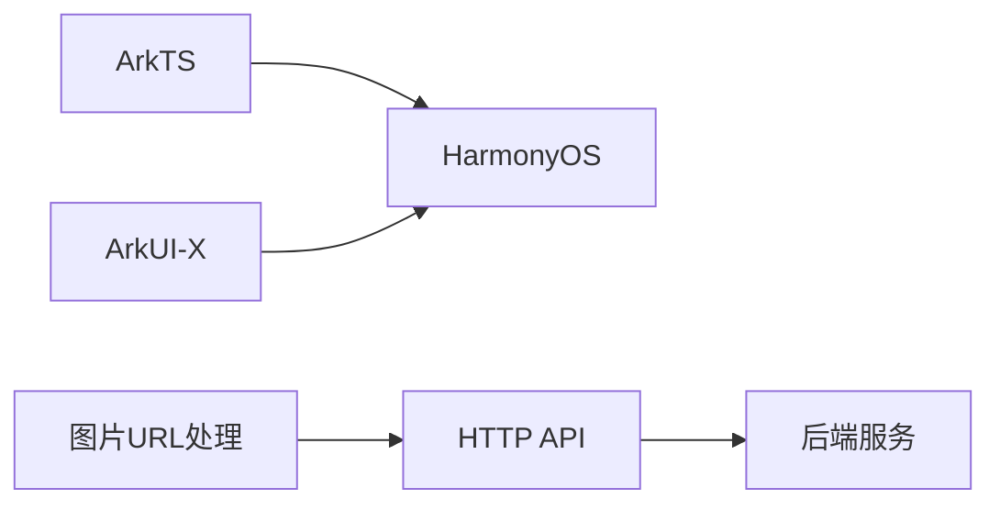
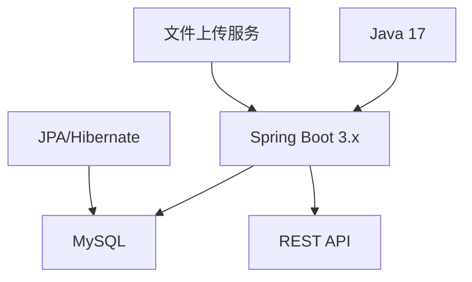
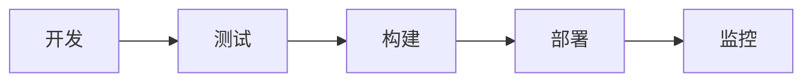

# 🌟 梦想生活规划师 APP

<div align="center">


</div>

## 📋 项目概述

基于鸿蒙HarmonyOS"梦想生活规划师"是一款助力梦想成真的生活伴侣应用，帮助用户制定、管理和实现个人梦想目标。应用通过科学的目标管理方法、社区互动和资源共享，为用户提供全方位的梦想实现支持。

## 💎 核心价值

- **🎯 梦想管理**：帮助用户系统化管理个人梦想和目标
- **📝 任务拆解**：将梦想分解为可执行的小任务，便于逐步实现
- **📊 进度追踪**：直观展示梦想实现的进度和成果
- **🤝 社区互动**：连接志同道合的用户，互相激励与支持
- **📚 资源共享**：提供实现梦想的相关学习资源和工具

## 🔧 技术架构

### 前端技术栈


- 🔹 **ArkTS**（基于鸿蒙HarmonyOS生态）
- 🔹 **ArkUI-X 5.0.4.106**
- 🔹 **智能图片URL处理**（自动适配不同环境）

### 后端技术栈


- 🔹 **Java 17**
- 🔹 **Spring Boot 3.x**
- 🔹 **JPA/Hibernate**
- 🔹 **MySQL 数据库**
- 🔹 **SpringDoc**（API文档）
- 🔹 **Lombok**
- 🔹 **文件上传与存储系统**

### 项目规范
- 🔹 阿里巴巴Java开发手册
- 🔹 统一异常处理
- 🔹 RESTful API设计
- 🔹 数据校验和安全处理
- 🔹 环境适配与URL处理策略

## 📱 功能模块

### 1. 👤 用户系统
- 用户注册与登录
- 个人资料管理
- 用户关注与互动

### 2. ✨ 梦想管理
- 梦想创建与编辑
- 梦想分类与标签
- 梦想进度跟踪
- 梦想优先级与截止日期设置
- 梦想图片上传与展示

### 3. ✅ 任务系统
- 任务创建与编辑
- 任务分解与关联
- 任务状态更新
- 任务提醒功能

### 4. 🌐 社区互动
- 动态发布与分享
- 点赞、评论功能
- 关注好友动态
- 成就分享与激励
- 图片分享与展示

### 5. 📖 资源中心
- 学习资源推荐
- 梦想实现工具推荐
- 用户资源分享

### 6. 📈 数据统计与分析
- 梦想完成率统计
- 任务执行情况分析
- 个人成长轨迹展示

## 📂 项目目录结构

### 前端（ArkTS）
```
YaoYaoLingXian/
  ├── entry/                # 应用入口
  │   ├── src/              # 源代码
  │   │   ├── main/         # 主要代码
  │   │   │   ├── ets/      # ArkTS代码
  │   │   │   │   ├── services/  # 服务层
  │   │   │   │   │   ├── ApiService.ets  # API服务
  │   │   │   │   ├── pages/     # 页面组件
  │   │   │   │   ├── model/     # 数据模型
  │   │   │   │   ├── utils/     # 工具类
  │   │   │   ├── resources/ # 资源文件
  ├── AppScope/             # 应用范围配置
  ├── oh_modules/           # 依赖模块
```

### 后端（Java）
```
Backend/
  ├── src/
  │   ├── main/
  │   │   ├── java/          # Java源代码
  │   │   │   ├── controller/ # 控制器
  │   │   │   ├── service/    # 服务层
  │   │   │   ├── repository/ # 数据访问层
  │   │   │   ├── entity/     # 实体类
  │   │   │   ├── dto/        # 数据传输对象
  │   │   │   ├── config/     # 配置类
  │   │   │   ├── exception/  # 异常处理
  │   │   │   ├── util/       # 工具类
  │   │   ├── resources/      # 资源配置
  ├── pom.xml                 # Maven配置
```

## 💾 数据库设计

数据库采用MySQL，主要包含以下核心表：

| 表名 | 描述 | 主要字段 |
|------|------|---------|
| `user` | 用户信息 | id, username, nickname, avatar, email |
| `dream` | 梦想目标 | id, user_id, title, description, category, image_url |
| `task` | 任务 | id, dream_id, title, status, priority |
| `progress` | 进度记录 | id, dream_id, completion_rate, updated_at, images |
| `resource` | 资源 | id, title, url, type, description |
| `tag` | 标签 | id, name, category |
| `post` | 社区动态 | id, user_id, content, images, created_at |
| `comment` | 评论 | id, post_id, user_id, content |
| `like` | 点赞 | id, user_id, post_id, created_at |
| `follow` | 关注关系 | id, user_id, follow_id |

## 🌐 多环境支持

应用支持多种环境配置，通过智能URL处理实现跨环境资源访问：

```typescript
// 不同环境的API基础URL配置
class ApiConfig {
  readonly ANDROID_EMULATOR: string = 'http://10.0.2.2:8080/api';
  readonly DEVICE: string = 'http://192.168.31.75:8080/api';
  readonly LOCAL: string = 'http://localhost:8080/api';
}

// 智能图片URL处理，确保在不同环境中正确访问图片资源
export function processImageUrl(url: string): string {
  if (!url) return '';
  
  // 处理相对路径
  if (!url.startsWith('http://') && !url.startsWith('https://')) {
    return `${BASE_URL}/${url}`;
  }
  
  // 处理包含localhost的URL
  if (url.includes('localhost')) {
    const urlParts = url.split('/api/');
    if (urlParts.length > 1) {
      return `${BASE_URL}/${urlParts[1]}`;
    }
  }
  
  return url;
}
```

## 🚀 开发与部署流程

### 开发环境
- 🔹 DevEco Studio (前端开发)
- 🔹 IntelliJ IDEA (后端开发)
- 🔹 MySQL 8.0+ (数据库)
- 🔹 Git (版本控制)

### 部署流程


1. 后端服务部署在云服务器
2. 前端应用打包发布到应用商店
3. 数据库部署在专用数据库服务器
4. CI/CD自动化部署流程

## 🛡️ 质量保障
- ✓ 单元测试与集成测试
- ✓ 代码审查
- ✓ 性能测试
- ✓ 安全漏洞扫描
- ✓ 跨环境兼容性测试

## 👥 项目团队
- 👨‍💼 产品经理：七七负责用户界面与交互设计
- 👨‍💻 前端开发：负责鸿蒙应用开发
- 👨‍💻 后端开发：负责服务端开发
- 👨‍🔧 测试工程师：负责质量保障
- 👨‍🔧 运维工程师：负责系统部署与维护

## 📱 应用预览


